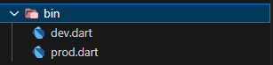
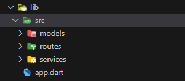
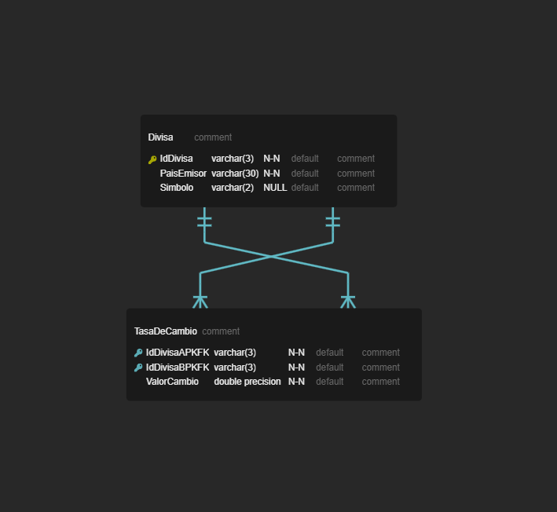
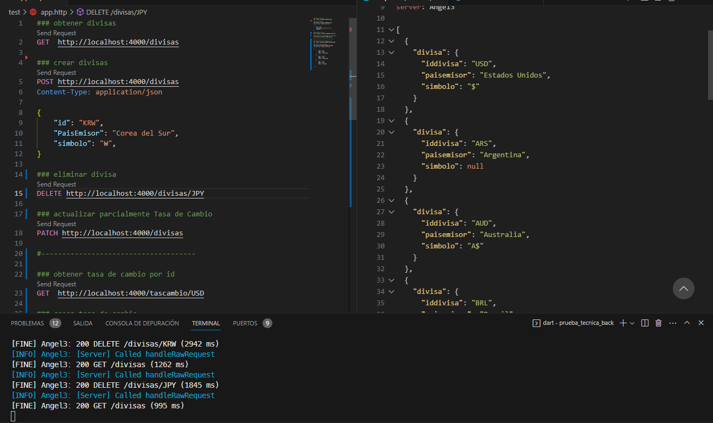
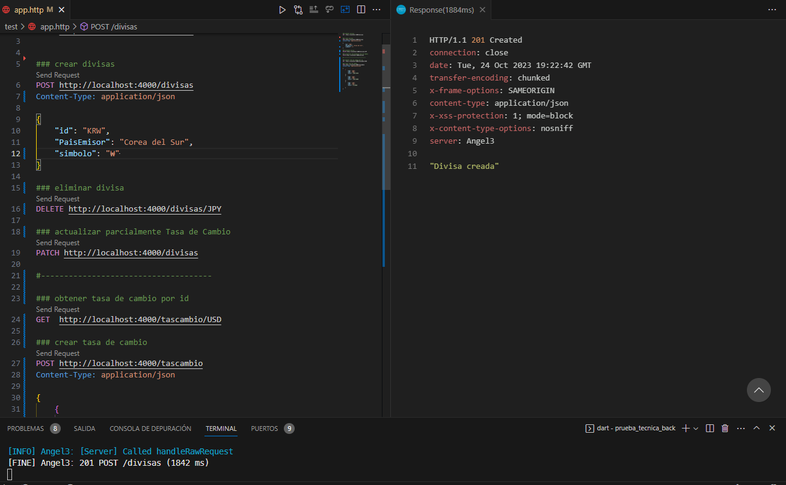
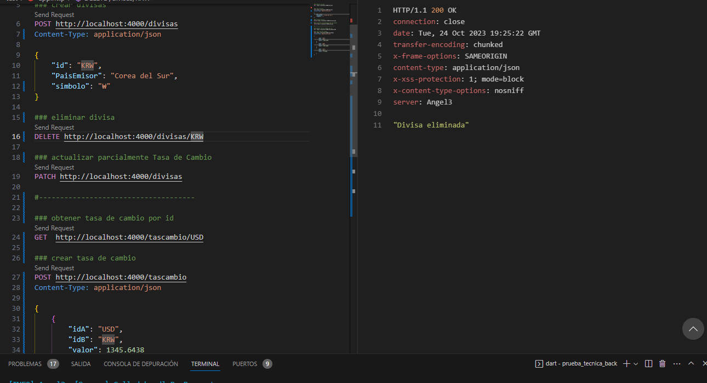
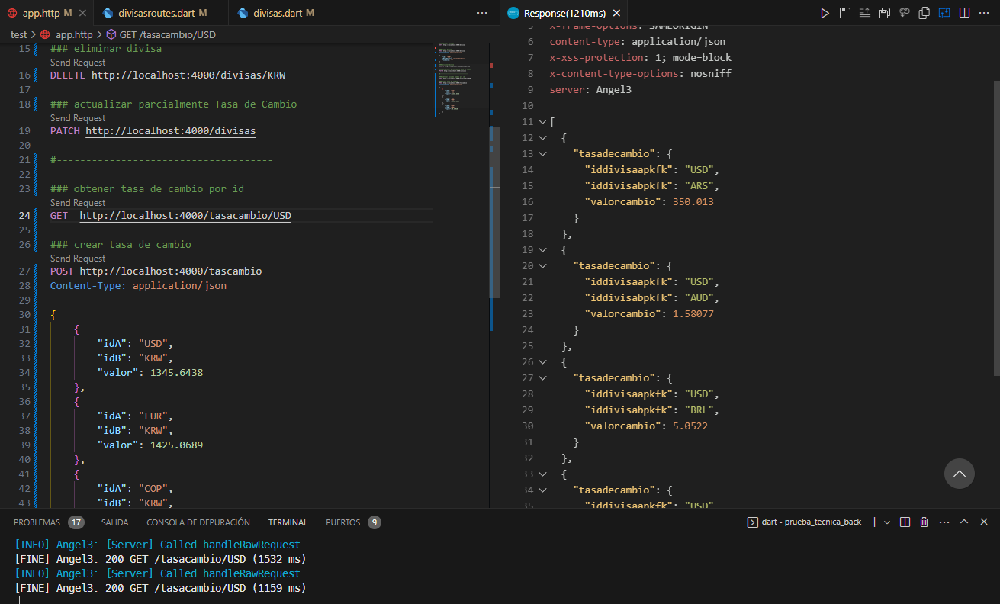
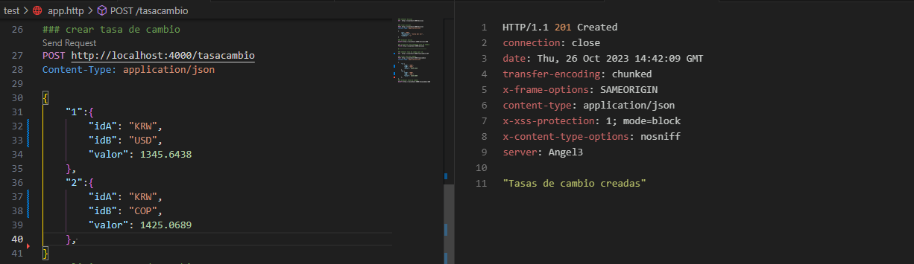
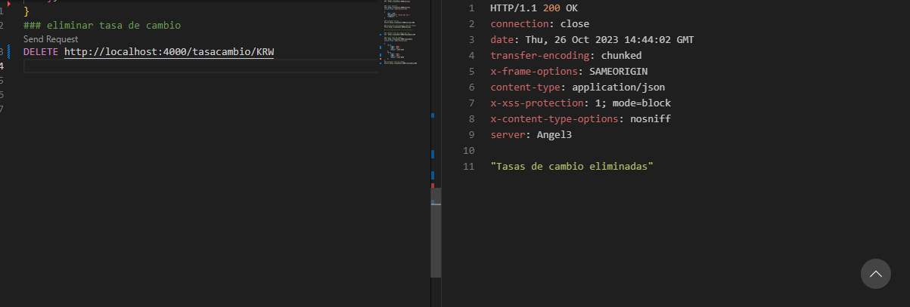

# API REST DIVISAS -JOHAN AGUIRRE DIAZ


## Instalación

### Lenguaje Dart

* Para la instalación del lenguaje pude seguir el [enlace](https://dart.dev/get-dart) que lo redirigirá a la documentación oficial
* Puedes seguir el siguiente [tutorial](https://www.youtube.com/watch?v=5tTDztEQzQQ&t=274s) para más obtener mas información sobre la instalación configuración y recomendación de IDES y exenciones para los mismos

### Framework Angel3

* Con el lenguaje instalado puedes clonar el  repositorio, dentro de la carpeta del repositorio clonado ejecuta el siguiente comando

    ```bash
    dart pub get  
    ```

    con esto vas a obtener  todos las dependencias del proyecto 

    Para ver que dependencias están implementadas proyecto en el proyecto puedes abrir el archivo **pubspec.yaml**. Para conocer mas sobre el framework puedes seguir el siguiente  [enlace](https://github.com/dukefirehawk/angel) que te llevar  a su repositorio  
    del mismo

## Stack Tecnológico

* Lenguaje de programación: Dart
* IDE usado : VSCODE
* Back-end(servidor):
  
  * Framework: Angel3
  
* Base de datos:
  * Gestor de base de datos: PostgreSQL

* Despliegue y alojamiento:
  * Base de Datos: [fl0](https://www.fl0.com/)
  
* Pruebas:
  * Unitarias : Rest Client

## Estructura del Proyecto 

### Estructuras de  Carpetas

<center></center>


#### Carpeta de Archivos de ejecución  

<center></center>

* El archivo **dev.dart** es el archivo para ejecutar en entorno de desarrollo permite la ejecución en hotreload ademas de las DevTools debugger. Se ejecuta de la siguiente manera  

```bash
   dart --enable-vm-service bin/dev.dart
```

* El archivo **prod.dev** es el archivo para ejecutar en entorno de producción. Se ejecuta de la siguiente manera.

```bash
   dart  bin/pro.dart
```


#### Estructura Logica del proyecto 
<center></center>

* La estructura implementa en este proyecto sigue el patron arquitectural MVC
  donde la carpeta  **models** guarda el modelo de las rutas Divisas y TasadeCambio

* La carpeta **routes**  almacena los endpoints y sus controladores
  
* La carpeta **services** almacena en este caso la conexión a la base de datos 

* El archivo **app.dart** es un acceso para cargar la configuración

## Modelo De datos

<center>
  

</center>

## Pruebas 

### Ruta divisas

<center>
<ul>
  <li>   método GET
    
  </li>
  <li>  método POST
    
  </li>
  <li>  método DELETE
    
  </li>
</ul>
</center>

### Ruta TasaCambio

<center>
<ul>
  <li>   método GET
    
  </li>
  <li>  método POST
    
  </li>
  <li>  método DELETE
    
  </li>
</ul>
</center>
